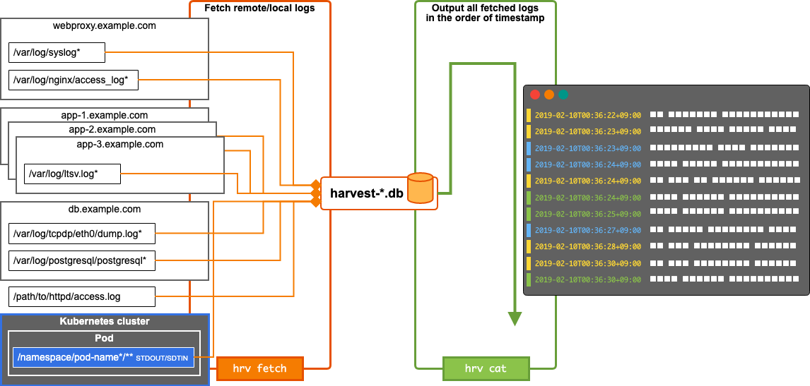
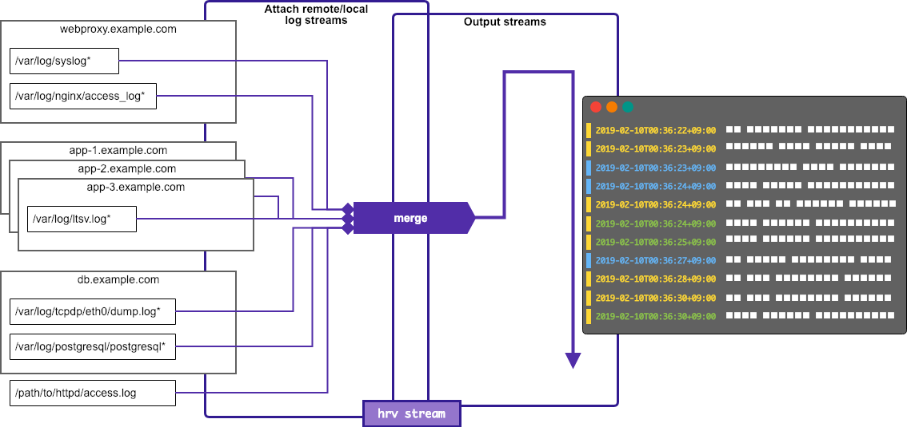

# Harvest [](https://travis-ci.org/k1LoW/harvest) [](https://github.com/k1LoW/harvest/releases)

> Portable log aggregation tool for middle-scale system operation/observation.

Harvest provides the `hrv` command with the following features.

- Agentless.
- Portable.
- Only 1 config file.
- Fetch various remote/local logs via SSH/exec. ( `hrv fetch` )
- Output all fetched logs in the order of timestamp. ( `hrv cat` )
- Stream various remote/local logs via SSH/exec. ( `hrv stream` )

## Usage

### Fetch and output remote/local logs

#### 1. Set log URLs (and log type) in config.yml

``` yaml
---
logs:
  -
    description: webproxy syslog
    type: syslog
    urls:
      - 'ssh://webproxy.example.com/var/log/syslog*'
    tags:
      - webproxy
      - syslog
  -
    description: webproxy NGINX access log
    type: combinedLog
    urls:
      - 'ssh://webproxy.example.com/var/log/nginx/access_log*'
    tags:
      - webproxy
      - nginx
  -
    description: app log
    type: regexp
    regexp: 'time:([^\t]+)'
    timeFormat: 'Jan 02 15:04:05'
    timeZone: '+0900'
    urls:
      - 'ssh://app-1.example.com/var/log/ltsv.log*'
      - 'ssh://app-2.example.com/var/log/ltsv.log*'
      - 'ssh://app-3.example.com/var/log/ltsv.log*'
    tags:
      - app
  -
    description: db dump log
    type: regexp
    regexp: '"ts":"([^"]+)"'
    timeFormat: '2006-01-02T15:04:05.999-0700'
    urls:
      - 'ssh://db.example.com/var/log/tcpdp/eth0/dump*'
    tags:
      - db
      - query
  -
    description: PostgreSQL log
    type: regexp
    regexp: '^\[?(\d{4}-\d{2}-\d{2} \d{2}:\d{2}:\d{2} [^ ]{3})'
    timeFormat: '2006-01-02 15:04:05 MST'
    multiLine: true
    urls:
      - 'ssh://db.example.com/var/log/postgresql/postgresql*'
    tags:
      - db
      - postgresql
  -
    description: local Apache access log
    type: combinedLog
    urls:
      - 'file:///path/to/httpd/access.log'
    tags:
      - httpd
```

#### 2. Fetch target logs via SSH/exec ( `hrv fecth` )

``` console
$ hrv fetch -c config.yml --tag=webproxy,db
```

#### 3. Output logs ( `hrv cat` )

``` console
$ hrv cat harvest-20181215T2338+900.db --with-timestamp --with-host --with-path | less -R
```

### Stream remote/local logs

#### 1. [Set config.yml](#1-set-log-urls-and-log-type-in-configyml)

#### 2. Stream target logs via SSH/exec ( `hrv stream` )

``` console
$ hrv stream -c config.yml --with-timestamp --with-host --with-path --with-tag
```

## Architecture

### `hrv fetch` and `hrv cat`



### `hrv stream`



## Installation

```console
$ brew install k1LoW/tap/harvest
```

or

```console
$ go get github.com/k1LoW/harvest/cmd/hrv
```

## What is "middle-scale system"?

- < 50 instances
- < 1 million logs per `hrv fetch`

### What if you are operating a large-scale/super-large-scale/hyper-large-scale system?

Let's consider agent-base log collector/platform, service mesh and distributed tracing platform!

## Internal

- [harvest-*.db database schema](doc/schema)

## Requirements

- UNIX commands
  - date
  - find
  - grep
  - head
  - ls
  - tail
  - xargs
  - zcat
- sudo
- SQLite

## WANT

- `hrv ls targets`
- `hrv info`
- `hrv analyze`
- `hrv download`
- tag DAG
- Viewer / Visualizer

## References

- [Hayabusa](https://github.com/hirolovesbeer/hayabusa): A Simple and Fast Full-Text Search Engine for Massive System Log Data
    - Make simple with a combination of commands.
    - Full-Text Search Engine using SQLite FTS.
