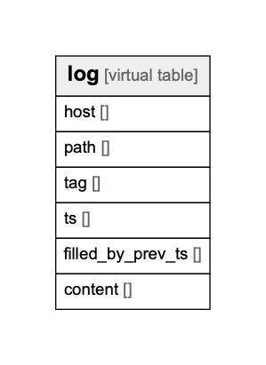

# harvest.db

## Tables

| Name | Columns | Comment | Type |
| ---- | ------- | ------- | ---- |
| [log](log.md) | 6 | fetched log data with host/path/tag/timestamp. | virtual table |

## Relations

---

> Generated by [tbls](https://github.com/k1LoW/tbls)
