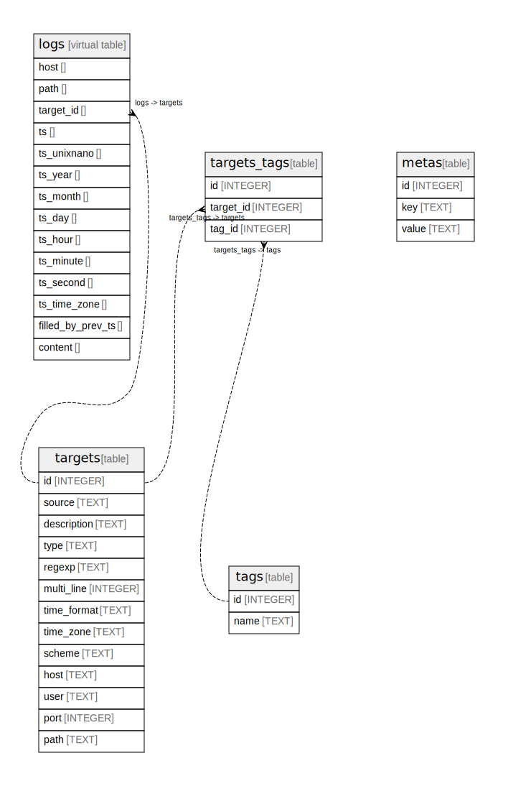

# harvest.db

## Tables

| Name                            | Columns | Comment | Type          |
| ------------------------------- | ------- | ------- | ------------- |
| [targets](targets.md)           | 13      |         | table         |
| [tags](tags.md)                 | 2       |         | table         |
| [targets_tags](targets_tags.md) | 3       |         | table         |
| [logs](logs.md)                 | 14      |         | virtual table |

## Relations

---

> Generated by [tbls](https://github.com/k1LoW/tbls)
