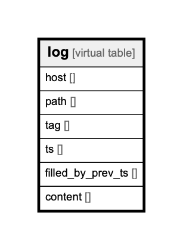

# log

## Description

fetched log data with host/path/tag/timestamp.

<details>
<summary><strong>Table Definition</strong></summary>

```sql
CREATE VIRTUAL TABLE log USING FTS4(host, path, tag, ts INTEGER, filled_by_prev_ts INTEGER, content)
```

</details>

## Columns

| Name | Type | Default | Nullable | Children | Parents | Comment |
| ---- | ---- | ------- | -------- | -------- | ------- | ------- |
| host |  |  | true |  |  | host |
| path |  |  | true |  |  | path |
| tag |  |  | true |  |  | tag |
| ts |  |  | true |  |  | timestamp (unixtime nano) |
| filled_by_prev_ts |  |  | true |  |  | if filled by prev row ts, true |
| content |  |  | true |  |  | raw log content |

## Relations



---

> Generated by [tbls](https://github.com/k1LoW/tbls)
