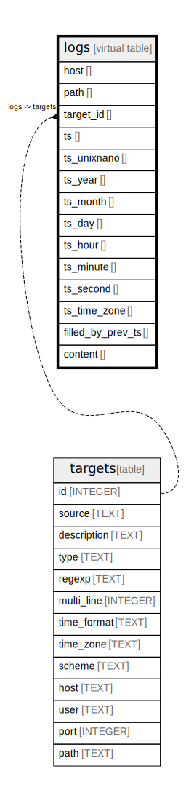

# logs

## Description

<details>
<summary><strong>Table Definition</strong></summary>

```sql
CREATE VIRTUAL TABLE logs USING FTS4(host, path, target_id INTEGER, ts INTEGER, filled_by_prev_ts INTEGER, content)
```

</details>

## Columns

| Name              | Type | Default | Nullable | Children | Parents               | Comment |
| ----------------- | ---- | ------- | -------- | -------- | --------------------- | ------- |
| host              |      |         | true     |          |                       |         |
| path              |      |         | true     |          |                       |         |
| target_id         |      |         | true     |          | [targets](targets.md) |         |
| ts                |      |         | true     |          |                       |         |
| filled_by_prev_ts |      |         | true     |          |                       |         |
| content           |      |         | true     |          |                       |         |

## Relations



---

> Generated by [tbls](https://github.com/k1LoW/tbls)
