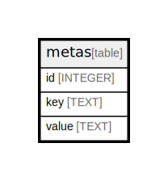

# metas

## Description

<details>
<summary><strong>Table Definition</strong></summary>

```sql
CREATE TABLE metas (
  id INTEGER PRIMARY KEY AUTOINCREMENT,
  key TEXT NOT NULL,
  value TEXT NOT NULL,
  UNIQUE(key)
)
```

</details>

## Columns

| Name  | Type    | Default | Nullable | Children | Parents | Comment |
| ----- | ------- | ------- | -------- | -------- | ------- | ------- |
| id    | INTEGER |         | true     |          |         |         |
| key   | TEXT    |         | false    |          |         |         |
| value | TEXT    |         | false    |          |         |         |

## Constraints

| Name                     | Type        | Definition       |
| ------------------------ | ----------- | ---------------- |
| id                       | PRIMARY KEY | PRIMARY KEY (id) |
| sqlite_autoindex_metas_1 | UNIQUE      | UNIQUE (key)     |

## Indexes

| Name                     | Definition   |
| ------------------------ | ------------ |
| sqlite_autoindex_metas_1 | UNIQUE (key) |

## Relations



---

> Generated by [tbls](https://github.com/k1LoW/tbls)
