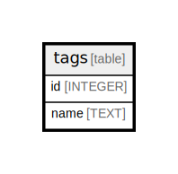

# tags

## Description

<details>
<summary><strong>Table Definition</strong></summary>

```sql
CREATE TABLE tags (
  id INTEGER PRIMARY KEY AUTOINCREMENT,
  name TEXT NOT NULL,
  UNIQUE(name)
)
```

</details>

## Columns

| Name | Type    | Default | Nullable | Children                        | Parents | Comment |
| ---- | ------- | ------- | -------- | ------------------------------- | ------- | ------- |
| id   | INTEGER |         | true     | [targets_tags](targets_tags.md) |         |         |
| name | TEXT    |         | false    |                                 |         |         |

## Constraints

| Name                    | Type        | Definition       |
| ----------------------- | ----------- | ---------------- |
| id                      | PRIMARY KEY | PRIMARY KEY (id) |
| sqlite_autoindex_tags_1 | UNIQUE      | UNIQUE (name)    |

## Indexes

| Name                    | Definition    |
| ----------------------- | ------------- |
| sqlite_autoindex_tags_1 | UNIQUE (name) |

## Relations



---

> Generated by [tbls](https://github.com/k1LoW/tbls)
