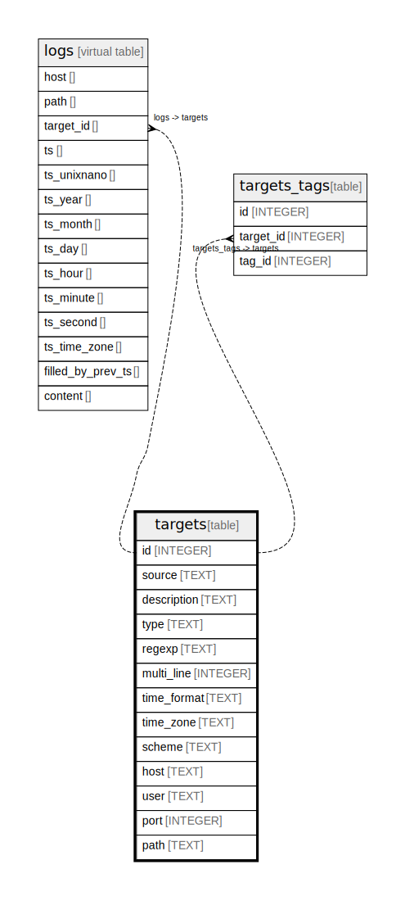

# targets

## Description

<details>
<summary><strong>Table Definition</strong></summary>

```sql
CREATE TABLE targets (
  id INTEGER PRIMARY KEY AUTOINCREMENT,
  source TEXT NOT NULL,
  description TEXT,
  type TEXT NOT NULL,
  regexp TEXT,
  multi_line INTEGER,
  time_format TEXT,
  time_zone TEXT,
  scheme TEXT NOT NULL,
  host TEXT,
  user TEXT,
  port INTEGER,
  path TEXT NOT NULL
)
```

</details>

## Columns

| Name        | Type    | Default | Nullable | Children                                        | Parents | Comment |
| ----------- | ------- | ------- | -------- | ----------------------------------------------- | ------- | ------- |
| id          | INTEGER |         | true     | [logs](logs.md) [targets_tags](targets_tags.md) |         |         |
| source      | TEXT    |         | false    |                                                 |         |         |
| description | TEXT    |         | true     |                                                 |         |         |
| type        | TEXT    |         | false    |                                                 |         |         |
| regexp      | TEXT    |         | true     |                                                 |         |         |
| multi_line  | INTEGER |         | true     |                                                 |         |         |
| time_format | TEXT    |         | true     |                                                 |         |         |
| time_zone   | TEXT    |         | true     |                                                 |         |         |
| scheme      | TEXT    |         | false    |                                                 |         |         |
| host        | TEXT    |         | true     |                                                 |         |         |
| user        | TEXT    |         | true     |                                                 |         |         |
| port        | INTEGER |         | true     |                                                 |         |         |
| path        | TEXT    |         | false    |                                                 |         |         |

## Constraints

| Name | Type        | Definition       |
| ---- | ----------- | ---------------- |
| id   | PRIMARY KEY | PRIMARY KEY (id) |

## Relations



---

> Generated by [tbls](https://github.com/k1LoW/tbls)
