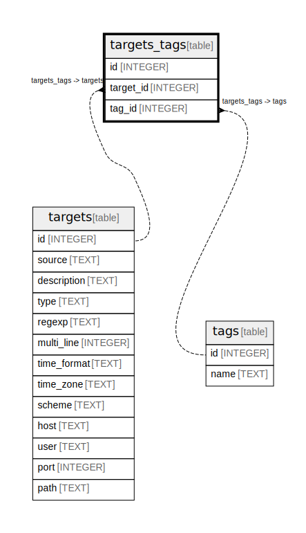

# targets_tags

## Description

<details>
<summary><strong>Table Definition</strong></summary>

```sql
CREATE TABLE targets_tags (
  id INTEGER PRIMARY KEY AUTOINCREMENT,
  target_id INTEGER NOT NULL,
  tag_id INTEGER NOT NULL,
  UNIQUE(target_id, tag_id)
)
```

</details>

## Columns

| Name      | Type    | Default | Nullable | Children | Parents | Comment |
| --------- | ------- | ------- | -------- | -------- | ------- | ------- |
| id        | INTEGER |         | true     |          |         |         |
| target_id | INTEGER |         | false    |          |         |         |
| tag_id    | INTEGER |         | false    |          |         |         |

## Constraints

| Name                            | Type        | Definition                 |
| ------------------------------- | ----------- | -------------------------- |
| id                              | PRIMARY KEY | PRIMARY KEY (id)           |
| sqlite_autoindex_targets_tags_1 | UNIQUE      | UNIQUE (target_id, tag_id) |

## Indexes

| Name                            | Definition                 |
| ------------------------------- | -------------------------- |
| sqlite_autoindex_targets_tags_1 | UNIQUE (target_id, tag_id) |

## Relations



---

> Generated by [tbls](https://github.com/k1LoW/tbls)
